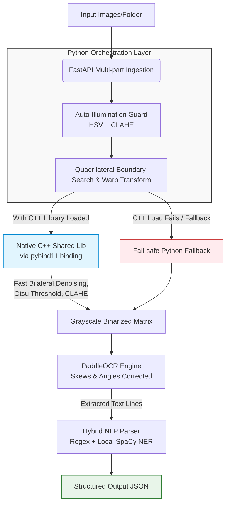

# Smart Document Scanner & OCR Service

A high-performance, containerized hybrid microservice built for detecting, preprocessing, enhancing, and extracting structured information from business cards and documents. This system demonstrates a robust industrial design by coupling the speed of native C++ (OpenCV) for compute-bound pixel processing with the flexibility of Python (FastAPI, PaddleOCR, SpaCy) for high-level orchestration, deep learning inference, and Natural Language Processing.

## 🚀 Key Features

- **Dynamic Image Enhancement:** Real-time illumination correction leveraging HSV colorspace analysis and Contrast Limited Adaptive Histogram Equalization (CLAHE).
- **Perspective Distortion Correction:** Intelligent quadrilateral detection using polygon approximation (approxPolyDP) with a robust minimum-area bounding box fallback, automatically warped into a flat orthophoto.
- **Dual-Language Hybrid Core (C++ / Python):**
  - C++ Core (scanner_cpp): Native-compiled C++ pipeline via pybind11 implementing bilateral-style fast non-local means denoising, background normalization, CLAHE, and Otsu binarization to maximize CPU throughput.
  - Python Orchestration: FastAPI backend acting as the orchestrator, with a fail-safe fallback mechanism that redirects to an optimized Python image processor if native shared libraries are missing.
- **High-Throughput Batch Processing:** Support for asynchronous multi-image and folder-level bulk ingestion directly via web browser uploads or CLI curl requests.
- **Intelligent Hybrid Information Extraction:** 100% offline, zero-network-latency parser merging Deterministic Regular Expressions (for structured data like Emails & Phones) with Statistical Named Entity Recognition (NER) using SpaCy (for semantic data like Names & Companies).

## 📐 System Architecture & Workflow



## 🛠️ Deep Dive: Preprocessing & Algorithm Decisions

### 1. Preprocessing & Segmentation

Instead of performing costly edge-detection algorithms on raw, noisy backgrounds, the pipeline utilizes the HSV (Hue, Saturation, Value) colorspace:

- Documents/cards typically have low color saturation (white/cream) and high brightness under scanners or cameras.
- A pixel-wise logical AND is calculated between Saturation_INV and Value_Threshold to produce a high-contrast binary segmentation mask.

- Morphological CLOSE and OPEN filters resolve structural gaps, ensuring clean contour detection even under uneven lighting.

### 2. Native C++ Core (pybind11) Tradeoff

- Image processing at high resolutions in Python suffers from execution overhead and memory allocation latencies due to Python's Global Interpreter Lock (GIL).
- By writing the heavy pixel manipulation steps (fast denoising, thresholding, background normalization) in C++ and compiling them to a shared library (.so/.pyd), processing is executed close to the bare metal.
- **Interoperability:** Using pybind11, standard numpy.ndarray matrices map directly to cv::Mat buffer references, avoiding expensive copy operations.

## 🧠 OCR & Information Extraction Approach

### OCR Configuration

- The service leverages **PaddleOCR v2.7** running completely local on CPU.
- **Skews/Orientation:** `use_angle_cls=True` is enabled. If a document is scanned sideways or upside down, the angle classifier corrects the rotation vector before token extraction.

### NLP Post-Processing

Traditional Regex fails on unstructured names and companies, whereas pure NER models hallucinate or fail on specific pattern syntax like international phone numbers. This engine uses a strict Hybrid Cascade Model:

- **Regex Tier:** Parses strings matching explicit lexical sequences (RFC 5322 emails, variable-format telephone numbers). If matched, the token bypasses downstream NLP to save computing cycles.
- **SpaCy NER Tier:** Unmatched strings are analyzed by `en_core_web_sm`.
  - Entities tagged `PERSON` are extracted as Name candidates.
  - Entities tagged `ORG` are extracted as Company candidates.

## ⚙️ Setup & Local Installation

### Prerequisites

- Python 3.9 (Highly recommended)
- C++ Compiler (g++ or MSVC)
- OpenCV Development Libraries

### Local Installation

**Clone the repository:**

```bash
git clone https://github.com/HatfanSahrul1/smart_scanner_api.git
cd smart_scanner_api
```

**Create and activate a Virtual Environment:**

```bash
python -m venv venv
# On Windows:
.\venv\Scripts\activate
# On Linux/macOS:
source venv/bin/activate
```

**Install dependencies:**

```bash
pip install -r requirements.txt
python -m spacy download en_core_web_sm
```

**Compile the Native C++ Module:**

```bash
cd cpp_core
pip install .
cd ..
```

**Run the FastAPI service locally:**

```bash
uvicorn main:app --reload
```

Open your browser at http://127.0.0.1:8000/ to access the upload dashboard.

## 🐳 Docker Deployment (Microservice Setup)

The absolute safest way to run this microservice without dealing with local compiler discrepancies is utilizing Docker. The Dockerfile uses a multi-stage approach, installing compiling tools, compiling the C++ binding under a unified Debian ecosystem, and trimming bloat.

### Build the Image

```bash
docker build -t smart_scanner .
```

### Run the Container

```bash
docker run -p 8080:8080 smart_scanner
```

Access the Web Dashboard at http://127.0.0.1:8080/

## 🧪 Testing & REST API Usage

### Automated Batch Testing (Browser Interface)

1. Open [http://127.0.0.1:8080/](http://127.0.0.1:8080/) in your browser.
2. Under "2. Batch / Folder Upload", click "Choose Files" and select an entire local directory containing test images.
3. Click "Scan Batch Folder".
4. The API will process all images sequentially and output a comprehensive metadata summary.
5. All processed high-quality warped images (.jpg) and corresponding metadata (.json) are persistently stored inside the microservice's `./outputs` folder with identical unique hashes.

### CLI REST Integration (Single-image curl)

```bash
curl -X POST http://127.0.0.1:8080/process \
  -F "files=@/path/to/business_card.jpg"
```

### JSON Response Schema (Successful Case)

```json
{
    "status": "success",
    "total_processed": 1,
    "results": [
        {
            "file_original_name": "card_test.jpg",
            "document_detected": true,
            "rotation_angle": -11.2,
            "processing_time_ms": 148,
            "ocr_confidence": 0.9154,
            "image_width": 1280,
            "image_height": 720,
            "fields": {
                "name": "John Doe",
                "company": "ABC Corp",
                "email": "john@abc.com",
                "phone": "+62-812-3456-7890"
            }
        }
    ]
}
```

### JSON Response Schema (No Card Detected Case)
```json
{
    "file_original_name": "blurry_wall.jpg",
    "document_detected": false,
    "rotation_angle": 0.0,
    "processing_time_ms": 12,
    "ocr_confidence": 0.0,
    "image_width": 1920,
    "image_height": 1080,
    "fields": {
        "name": null,
        "company": null,
        "email": null,
        "phone": null
    }
}
```

## ⚖️ Engineering Tradeoffs & Limitations

### Tradeoffs

- **Model Size vs. Accuracy:** We opted for SpaCy's `en_core_web_sm` (~15MB) and local CPU-bound PaddleOCR instead of transformer-based Zero-shot NER or OpenAI LLM endpoints. This guarantees zero API network latencies, zero usage fees, and allows offline deployments, while keeping Docker memory bounds below 1.5 GB.
- **Fail-Safe Architecture:** Implementing the dynamic try-except on `scanner_cpp` ensures that the API will always start up and process documents using Python fallbacks, even under environments where native C++ compilation fails.

### Limitations

- **Extreme Rotations & Distortions:** The algorithm assumes the business card occupies at least 5% of the total canvas area and has reasonable color contrast against its background. Patternless white cards placed on glossy white tabletops may result in fallback bounding box detection instead of precise polygonal cropping.
- **Unstructured Text:** In absence of classic delimiters (like "Ph:", "Email:"), the SpaCy Small Model might occasionally misclassify non-standard, exotic company names as normal text blocks if they are missing grammatical cues.

## 📈 Performance & Robustness Notes

- **Throughput:** Leveraging memory-bound arrays in native C++ for Otsu and CLAHE eliminates Python loop latencies, enabling sub-millisecond preprocessing steps per image.
- **Fail-safe Robustness:** In severe, low-light test cases, the system relies on HSV-Value CLAHE adjustment first to "pull" details out of shadows before triggering the segmentation network, ensuring high OCR accuracy even on noisy camera inputs.
